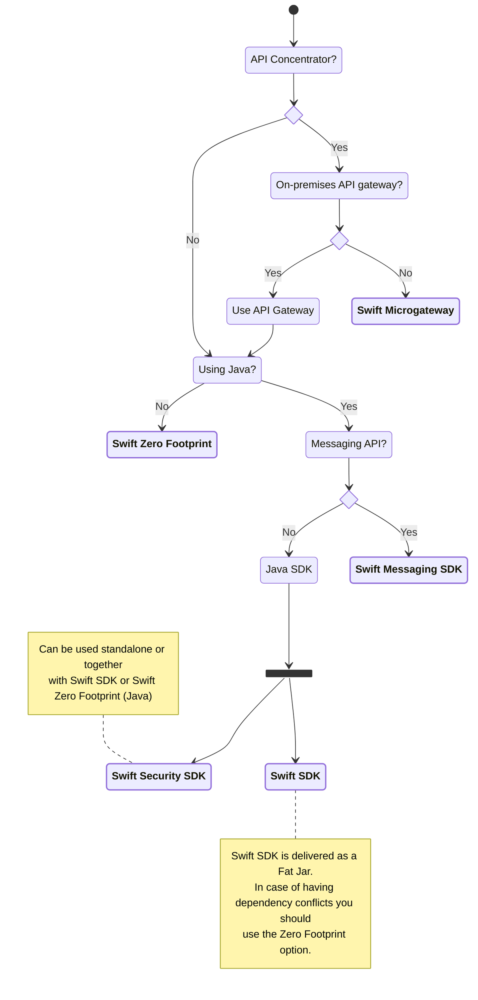

# Catalogue

In order to enhance the communication channel and consume new and some existing services offered by Swift, API as a connectivity channel has been introduced by Swift.

Swift offers multiple avenues for the community to access the comprehensive array of API-based services. 

## Swift SDK 

The Swift SDK is a API library that can be seamlessly embedded in a Java application. Its primary purpose is to streamline the utilization of Swift Services through APIs. By using the Swift SDK, users can construct their software application atop Swift APIs, thereby simplifying the coding process by abstracting the intricacies of coding directly against a Web Service Interface. 

This approach empowers developers to focus on building with business objects instead of directly adhering to the API specifications. Swift SDK provides APIs that hides much of the underlying complexity including authentication, authorization, signing and error handling.

### Swift Security SDK

Swift Security SDK is also a Java based library which is the underlying components for both Swift SDK as well as Swift Microgateway. This component is responsible for handling the security aspect of API communication covering session management, non-repudiation and RBAC (Role Based Access Control) based on SwiftNet PKI. 

The key difference between Swift SDK and Swift Security SDK is that Swift Security SDK only caters towards the security aspect of establishing a secure API session, allowing the bank to build their own API client or Microgateway by using the Security SDK.

:::info
You can deploy Swift Security SDK in **any** Java based application or your own API gateway to manage the security aspect of establishing secure API session and handle the business aspect of your own in line with your organizational preferences such as building your own API client.
:::

## Swift Zero Footprint

Customers can build and implement their own API client or Microgateway based on any programming language. In this option, Swift only provides explanations for establishing MV-SIPN security model based on Channel Certificate. User can download specification for a new Swift API in OAS (OpenAPI specification) from Swift Developer Portal and generate SDK code in any programming language using Swagger Codegen or OpenAPI code generator or an API client from scratch. 

## Swift Microgateway

Swift Microgateway is a single gateway to access and offer API based services from Swift. It is a software product that enables users to benefit from a wide range of API based services offered by Swift.By deploying Swift Microgateway, customers can configure, manage and monitor all the API calls they make with regards to such services. Swift Microgateway supports configurations to consume or expose data over different API environments offered by Swift.

If you are using Swift Microgateway, it would be required to have an API client in your application to initiate/process API requests/responses from Swift Microgateway. The API client can either be Swift offered Swift SDK or your own API client in your application.

## Swift SDK & Swift Microgateway

Another possible option to consume Swift API based services is by using a combination of Swift SDK & Swift Microgateway together. This allows users to utilize Swift SDK as an API client on a Java based application and use Swift Microgateway as an API proxy for managing security related tasks such as Session Management or implementing MV-SIPN based API security model. 

This options offers the user with increased flexibility and enables them to fully utilize key advantages offered by both Swift SDK & Swift Microgateway. 

Swift SDK will be embedded in the application to initiate and recieve API requests/response, thereby managing the business aspects of the services such as request creation, validation etc. whereas Swift Microgateway can manage the security and monitoring related activities such as signing the request. 

{/*## Decision tree

The following decision tree can be used to select the appropriate API connectivity footprint for your organization.

*/}