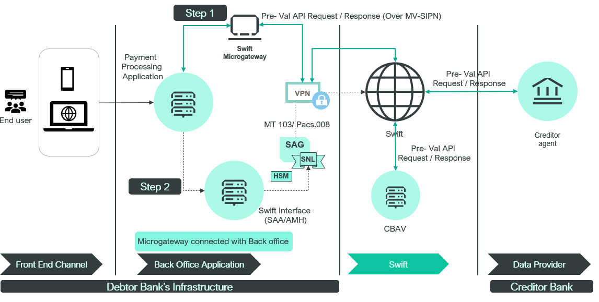

# Swift Microgateway

:::info
This is just a sample implementation for visual depiction of process and flows only
:::

In this scenario, the bank has opted to utilize pre-validation services as a consumer and has chosen their backend channel for deploying the API connectivity footprint. The chosen approach involves employing Swift Microgateway as the API Connectivity footprint.

Swift Microgateway is integrated with the Payment Processing Application and also with SAG and VPN at the Customer Premises.

## Swift Microgateway Flow

When a bank customer initiates a cross-border transaction via their Front End Channel (like mobile banking or internet banking interface), the necessary information for generating a MT 103 or a pacs. 008 message is passed from the front-end channel to the Payment Processing Application (such as Core Banking Application).

### Step 1

Given that the bank is a subscriber to pre-validation services as a Consumer, an API request is created by the Payment Processing Application for pre-validation. This request is directed towards the Swift Microgateway, residing within the bank's premises, securely nestled in the Swift Secure Zone.

This request could serve one of two purposes:
* To verify the existence and eligibility of an account to receive funds using the Pre-Validation Beneficiary Account Validation service provided by the Data Provider.

    OR

* To validate the account format, such as IBAN or Purpose code, using Pre-validation CBAV services.

Upon receiving the API request from Payment Processing Application, the Swift Microgateway establishes a secure session with the Swift API Gateway (on Swift's side) and forwards the API request for pre-validation.

On the Swift side, based on the incoming API request, the Swift API Gateway routes the request to either the Data Provider or Swift Central Services for processing.

Subsequent to the processing of the incoming pre-validation request, Swift responds back to the Bank's Swift Microgateway with an API response. For the purposes of this example, let's assume that the response received by the bank is a success.

### Step 2

Consequently, the Payment Processing application receives confirmation that the pre-validation request was successful and valid. Following this, the corresponding payment message (either an MT 103 or a pacs.008) is generated within the Payment Processing application and then relayed to the Swift Interface (such as Swift Alliance Access) for processing and transmission to the counterparty bank.

The successful validation of the message, prior to its transmission to the counterparty banks, ensures the success of the payment request and mitigates the possibility of any unforeseen declines or rejections by the bank.
