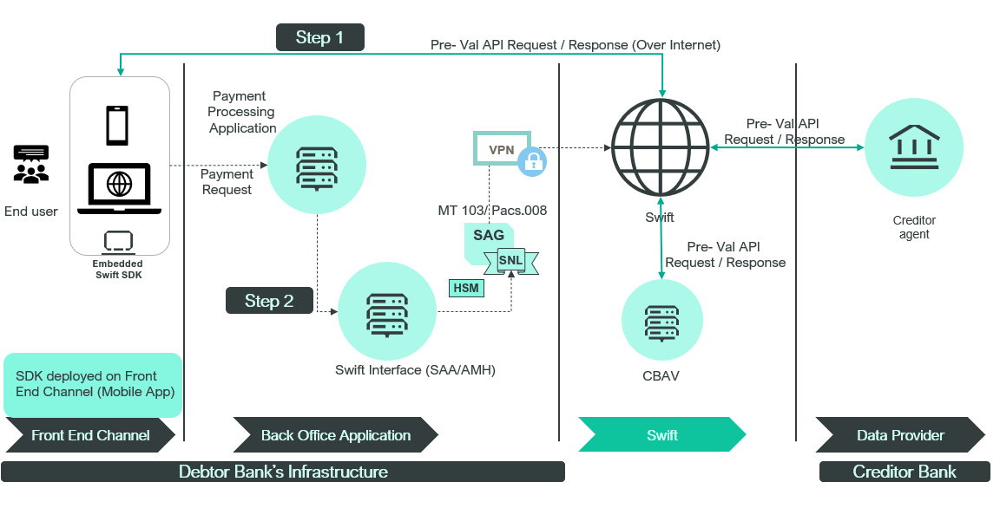

# Swift SDK

:::info
This is just a sample implementation for visual depiction of process and flows only
:::

In this scenario, the bank has opted to utilize pre-validation services as a consumer and has chosen their front end channel for deploying the API connectivity footprint. The chosen approach involves embedding Swift SDK/Own API Client as the API Connectivity footprint.

The bank's decision entails deploying Swift SDK on their front end channel (such as mobile banking application). The mobile banking application is already integrated with the Payment Processing application for processing payment requests. This Payment Processing application similar to the previous example is already linked with a Swift Interface (such as Alliance Access or AMH). 

## Swift SDK Flow

When a bank customer initiates a cross-border transaction via their Front End Channel (in this case the mobile banking application ), the necessary information for generating a corresponding payment message (a MT 103 or a pacs. 008) message is initially validated using Swift Pre-validation services.

### Step 1

Given that the bank is a subscriber to pre-validation services as a Consumer, Swift SDK deployed in the mobile banking application is employed to create an API request. This request is directed over the Internet to Swift API Gateway on Swift side.

This request could serve one of two purposes:
* To verify the existence and eligibility of an account to receive funds using the Pre-Validation Beneficiary Account Validation service provided by the Data Provider. 

    OR

* To validate the account format, such as IBAN or Purpose code, using Pre-validation CBAV services.

On the Swift side, based on the incoming API request, the Swift API Gateway routes the request to either the Data Provider or Swift Central Services for processing.

Subsequent to the processing of the incoming pre-validation request, Swift responds back to the Bank's Swift Microgateway with an API response. For the purposes of this example, let's assume that the response received by the bank is a success.

### Step 2

Consequently, after successfully validating all the information provided by the end user, the mobile banking application initiates a payment request to the Payment Processing application. Following this, the corresponding payment message (either an MT 103 or a pacs.008) is generated within the Payment Processing application and then relayed to the Swift Interface (such as Swift Alliance Access) for processing and transmission to the counterparty bank.

The successful validation of the message, prior to its transmission to the counterparty banks, ensures the success of the payment request and mitigates the possibility of any unforeseen declines or rejections by the bank.

