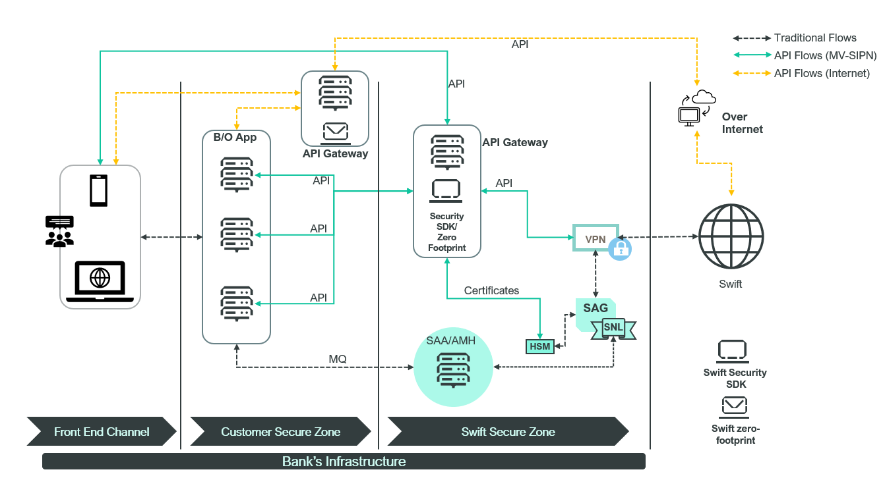

# Swift Zero-Footprint

:::info
This is just a sample implementation for visual depiction of process and flows only
:::

In this scenario, the bank has opted to utilize Zero Footprint approach to consumer Swift API Services. As some of the Swift API services are offered only over Internet , some only over MV-SIPN and some over a combination of both. The bank has decided to maintain two separate channels for API connectivity in order to manage the CSP compliance requirements associated with accessing Swift Secure Zone.

The bank has decided to use their existing API Gateway, as a connectivity route to Swift API services and used a Zero footprint approach. 

## Swift Zero-Footprint Flow

In this case the bank has referred to the Swift Security SDK to develop their own API client as well as for ensuring required security measures are implemented, which are needed to consumer Swift API services such as session management, token generation.

Benefit achieved by the bank in this approach:
1. Reuse existing API Gateway 
2. Build require API client based on the supported language of their respective back office applications.
3. Concentrate multiple API services to a single API gateway, helping in managing and monitoring all API calls.
4. Establishing security related controls on the API gateway one time and reusing the same for all subsequent API services implementations
5. Fully able to manage and maintain all component since these are already owned/managed by the bank, with zero dependency on Swift.

In this approach, the bank has deployed two instances of API gateway:
1. Customer Secure zone: To cater to over the internet API services.
2. Swift Secure zone: To cater to over MV-SIPN API services.

This ensures the bank can protect the Secure zone from direct internet access and providing a more secure infrastructure setup.

Bank can use their existing processes to connect their various back office application/front end channel to these API gateways using their existing operational procedures and simple treat the API gateway as Swift API footprint. 

These API gateways in turn can either use Swift Security SDK or Zero Footprint approach to either talk to HSM or Disk based certificates to ensure the required signing of all API messages and can also be deployed in High availability mode(Multi Tenancy – as per the capability of the bank’s API gateway), thereby ensuing resiliency and availability requirements of the bank.

:::info
Sample reference code for some of the 3rd party API gateways for connecting with HSM for certificates are already available under the [Sample code](/category/sample-code) section. 
:::
