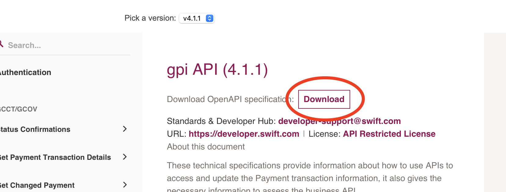

# OpenAPI

The OpenAPI Specification defines a standard interface to RESTful APIs.
Swift APIs are designed using ISO 20022 standards and described using OpenAPI 3.0.0.

## OpenAPI specification

OpenAPI is a specification for building APIs. It is a standard, language-agnostic interface to RESTful APIs which allows both humans and computers to discover and understand the capabilities of the service without access to source code, documentation, or through network traffic inspection.

OpenAPI definition files can be written in either YAML or JSON and they describe the endpoints (URLs), the methods on those endpoints (GET/POST), the format of the request and response data, authentication methods, contact information, license, terms of use, and other information.

The OpenAPI definition files are available in the [APIs](https://developer.swift.com/reference) section of the Swift Developer Portal.

### OpenAPI generator

:::info
The [Swift SDK](https://developer.swift.com/swift-sdk) and the [sample code](/docs/consumer/sample-code/quickstart) use the OpenAPI definition files provided in the [Swift Developer Portal](https://developer.swift.com/reference) to generate the client libraries and models.
:::

Tools can use the OpenAPI definitions to generate documentation, client libraries, or even entire server stubs in various languages. This can significantly reduce the amount of work needed to build and maintain APIs and services.

OpenAPI Generator CLI is a code generator that can generate API client libraries (SDK generation), server stubs, documentation and configuration files from an OpenAPI 3.0 specification. It supports many languages and frameworks, including Java, C#, Python, JavaScript, TypeScript, Go, PHP, C++, and more.

The generator can be installed following the instructions in the [OpenAPI Generator documentation](https://openapi-generator.tech/docs/installation).

Examples on how to generate the client libraries and models for the Swift APIs can be found in the sample code for [Java](/docs/consumer/sample-code/java/spring-boot#openapi-code-generator), [C#](/docs/consumer/sample-code/dotnet#openapi-code-generator), [Node.js](/docs/consumer/sample-code/nodejs#openapi-code-generator) and [Python](/docs/consumer/sample-code/python#openapi-code-generator) programming languages.
