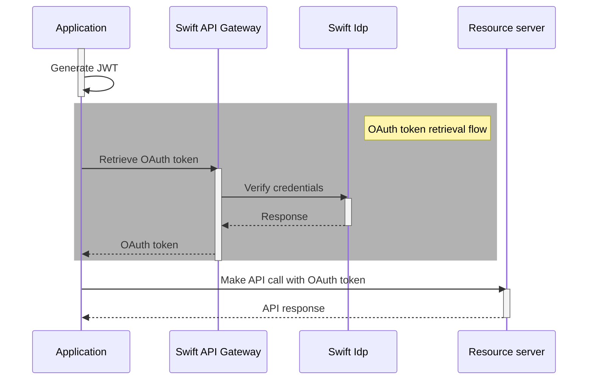

JWTs as Authorization Grants for OAuth 2.0 is used to authorize API calls to the Swift API Gateway.

The authorization process is as follows:

1. Generate a JSON Web Token (JWT) using your application credentials
2. Use the JWT to retrieve an OAuth token
    * Authentication of the client is performed using HTTP Basic Authentication with the [application credentials](/consumer/security/application-credentials).
3. Use the OAuth token to make the API call

