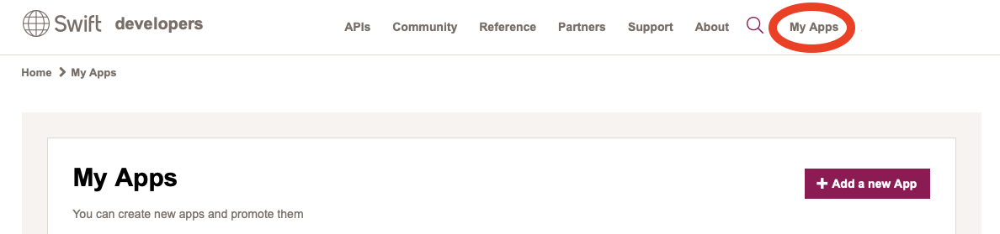
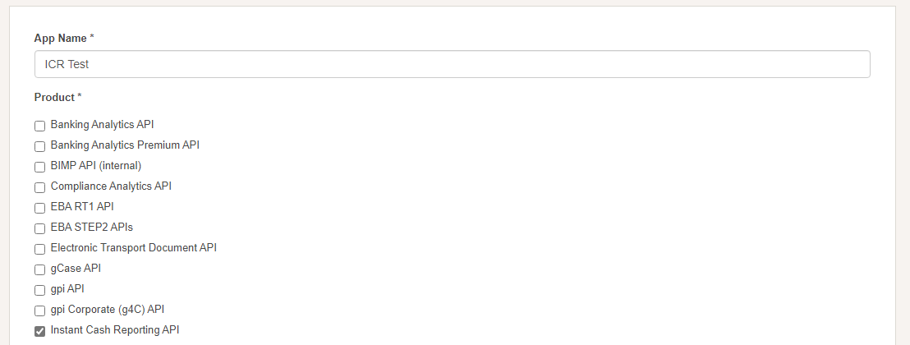
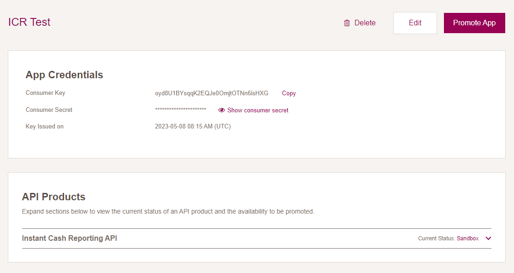

# Application credentails

Any application that uses OAuth 2.0 to access Swift APIs must have authentication credentials that identify the application to Swift's OAuth 2.0 server.

:::info
The `Consumer Key` and `Consumer Secret` are used as basic authentication credentials during the [OAuth token retrieval.](./oauth-authentication)
:::

## Create an application

Creating your own application allows you to generate a set of credentials to access the API products in the sandbox, test and production environments.

1. Sign up for an account with the [Swift Developer Portal](https://developer.swift.com/user/login?destination=%3Cfront%3E)
2. [Go to MyApps page](https://developer.swift.com/myapps) and add new App

3. Give a name to the application and choose the API product from the list. More than one API product can be selected.

## Promote the application

:::caution
It takes up to **2 days** for the application to be promoted.
:::

New applications are created in Sandbox environment and aren't promoted to test/production automatically. To use the APIs in test and production environments, you have to promote your App from the Swift Developer Portal.

Steps to promote the application:

1. Select the App created in the previous step
2. Click Promote App

3. Verify information in the pop-up window
4. To confirm, click Promote