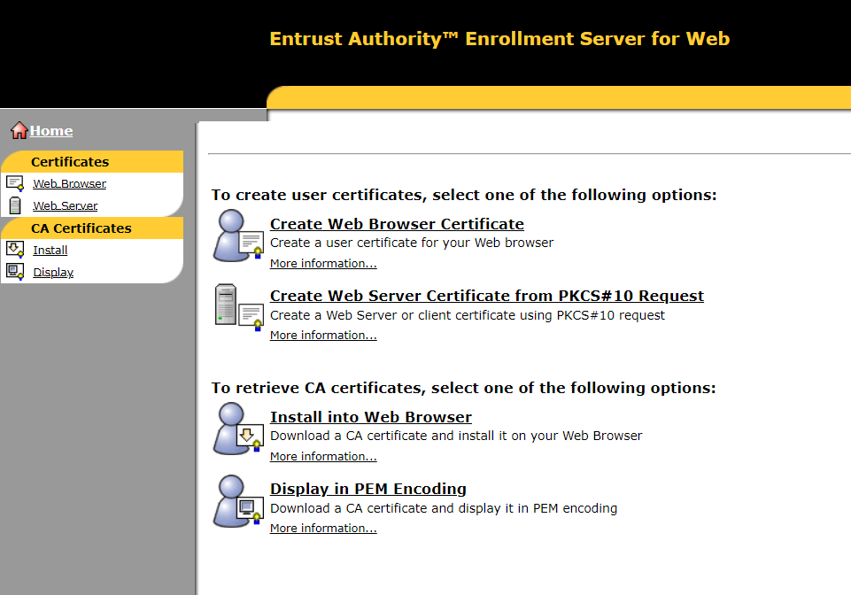

import Tabs from '@theme/Tabs';
import TabItem from '@theme/TabItem';

# Channel certificate

A channel certificate is an encrypted, **disk-based profile file** that provides a means for Swift to authenticate the identity of an application,
or to secure the connection between a client application and the Swift servers.

Channel certificate is typically stored in a keystore but any other storage can be used as long as the certificate is protected.

Below steps explain how to create a channel certificate using the SwiftNet PKI portal and how to import it into a keystore.

## Create channel certificate in O2M
In order to obtain a channel certificate, the security officer needs to create a user certificate in the O2M portal.

### Creating a Channel certificate in Swift PKI
1. Log in to O2M and access "Certificate Management - User" screen


2. Select parent DN where service provider DN would be created and click New in the bottom-right corner


4. Enter the DN name (for example, cn=gpi-test)


5. Select Channel as certificate class


6. Finally click OK

:::info
The Security Officer must assign the correct Service [RBAC role](/consumer/security/swiftnet-pki/rbac-roles) to the newly created Distinguished Name (DN)
:::

## Create the keystore

To store the certificate and private key, a keystore is required. The keystore can be created using either keytool or OpenSSH. 
The keystore will contain the private key, the certificate and Swift CA certificate.
Before generating the key pair, the Swift CA certificate must be imported into the keystore.

### Import Swift CA certificate
Browse to Entrust Authority Enrollment Server for Web using one of the following URLs:

* https://wbcl01.swiftnet.sipn.swift.com:49171/cda-cgi/clientcgi?action=start
* https://wbcl02.swiftnet.sipn.swift.com:49171/cda-cgi/clientcgi?action=start



In the area `To retrieve CA certificates`, select the option `Display in PEM encoding` and
save the PEM encoded certificate in a text file with name `swiftca.pem`.


Use keytool to create a keystore and import the Swift CA certificate:
<Tabs groupId="certificate-tool">
<TabItem value="keytool" label="Keytool">

```shell
keytool -import -trustcacerts -alias swiftca -file swiftca.pem -keystore keystore.jks
```

</TabItem>
<TabItem value="openssh" label="OpenSSH">

```shell
openssl x509 -in swiftca.pem -outform der -out swiftca.der
openssl pkcs12 -export -in swiftca.der -out keystore.p12 -nokeys
```

</TabItem>
</Tabs>

### Create public/private key pair

Once we have the Swift CA certificate imported, we can create the key pair.

:::info
Below commands contains the following variables:
* The `REFERENCE NUMBER` value is the one provided by the O2M during the [Create channel certificate in O2M](#create-channel-certificate-in-o2m) step.
* The `ALIAS_NAME` is just an identifier for the key and certificate. You can use any name you want.
:::

<Tabs groupId="certificate-tool">
<TabItem value="keytool" label="Keytool">

```shell
keytool -genkey -alias ALIAS_NAME -keyalg RSA -keysize 2048 -dname "cn=REFERENCE_NUMBER,o=swift" -keystore keystore.jks
```

</TabItem>
<TabItem value="openssh" label="OpenSSH">

```shell
openssl genpkey -algorithm RSA -out private_key.pem -aes256
```

</TabItem>
</Tabs>

Either keytool or openssh can be used to generate the keystore. The following example uses keytool.

:::tip
Given the reference number `67231361` and certificate alias `gpi` the command should be:

```shell
keytool -genkey -alias gpi -keyalg RSA -keysize 2048 -dname "cn=67231361,o=swift" -keystore keystore.jks
```
:::


### Generate CSR

The generated keypair in previous step is used to generate a certificate signing request (CSR).
The CSR is used to request a certificate from the Swift CA.

<Tabs groupId="certificate-tool">
<TabItem value="keytool" label="Keytool">

```shell
keytool -certreq -alias ALIAS_NAME -file csr.pem -keystore keystore.jks
```

</TabItem>
<TabItem value="openssh" label="OpenSSH">

```shell
openssl req -new -key private_key.pem -out csr.pem -subj "/CN=REFERENCE_NUMBER/O=swift"
```

</TabItem>
</Tabs>

### Sign the certificate with the Swift CA

The CSR generated in the previous step is used to request a certificate from the Swift CA.

1. Browse to Entrust Authority Enrollment Server for Web using one of the following URLs:
    * https://wbcl01.swiftnet.sipn.swift.com:49171/cda-cgi/clientcgi?action=start
    * https://wbcl02.swiftnet.sipn.swift.com:49171/cda-cgi/clientcgi?action=start

2. Click `Create Web Server Certificate from PKCS#10 Request` in the area to create user certificates


3. Make sure that you enter the `REFERENCE NUMBER` and `AUTHORISATION CODE` that you received from the security officer.
Select `Displayed as PEM encoding of certificate in raw DER` from the drop-down list.
Paste the content of the certificate signing request from `csr.pem` file.


6. Click Submit Request

7. Save the PEM encoded certificate in a file with name `signed_cert.pem`.

### Import the certificate

Finally, the certificate signed by the Swift CA is imported into the keystore.

<Tabs groupId="certificate-tool">
<TabItem value="keytool" label="Keytool">

```shell
keytool -import -alias ALIAS_NAME -file signed_cert.pem -keystore keystore.jks
```

</TabItem>
<TabItem value="openssh" label="OpenSSH">

```shell
openssl pkcs12 -export -in signed_cert.pem -inkey private_key.pem -out keystore.p12
```

</TabItem>
</Tabs>


## Renew the channel certificate

The channel certificate is valid for 2 years. The certificate can be renewed using the same process as described above.
