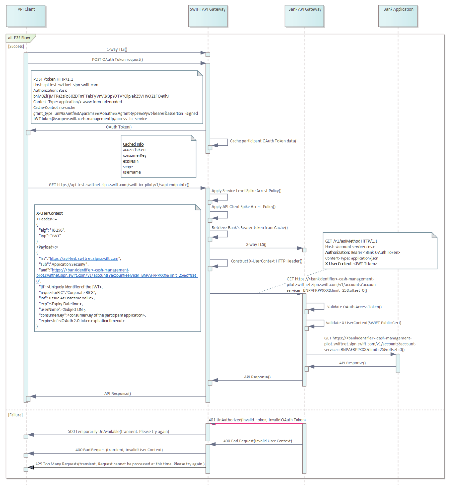

# API Flow

## Diagram

The following diagram shows the API flow between the API Client, Swift API Gateway, and the Bank API Gateway.



1. An API Client makes an OAuth Token request. The token grant request is a POST of a URL encoded form
   conforming to RFC 6749. For example `https://api-test.swiftnet.sipn.swift.com/oauth2/v1/token`.

2. Swift API Gateway validates OAuth Token request and responds with an OAuth Token
   Token grant JSON response containing the granted token and other required parameters if success, or a
   JSON error response if token is not granted, as per [RFC6749](https://tools.ietf.org/html/rfc6749).

3. An API Client makes Instant Cash Reporting API request by presenting the Swift issued access token in the
   Authorization header. For example `https://api-test.swiftnet.sipn.swift.com/swift-cash-management-api-pilot/v1/<api endpoint\>`.

4. Swift API Gateway validates the access token presented by the client application.

5. Swift API Gateway applies Spike Arrest Policy at the API Service Level to protect Service Provider
   application against traffic surges. It throttles the number of requests processed by API Gateway and sent to
   backend, protecting against performance lags and downtime.

6. Swift API Gateway checks if the service providing application has additional authorization controls.

7. If point 7 evaluates to `TRUE`, then Swift API Gateway checks if it has a valid Access Token from the service
   provider (Bank API Gateway) in its cache. If an access token is not found, then Swift API Gateway initiates
   an OAuth Token grant request to the Service Provider Authorization Server c.f. Section 2 for OAuth Token
   Grant Request details

8. Swift API Gateway rewrites the Authorization Header with the access token received from Service Provider
   Authorization Server.

9. Swift API Gateway creates `X-UserContext` HTTP Header which is a signed JWT token.

## X-UserContext HTTP Header

The `X-UserContext` HTTP Header is a signed JWT token.
The JWT token is signed using the private key of the Swift API Gateway and can be verified using the public key of the Swift API Gateway.

### JWT token structure

The JWT token contains the following header and claims:

#### Header

| Parameter | Description                                           |
| --------- | ----------------------------------------------------- |
| typ       | Type of the signed and encoded object. Must be “JWT”. |
| alg       | Algorithm. “RS256”.                                   |

```json title="JWT Header example before encoding"
{
  "typ": "JWT",
  "alg": "RS256"
}
```

#### Claims

| JWT Claim    | Description                                                                                                                                                                                                                                                                                    |
| ------------ | ---------------------------------------------------------------------------------------------------------------------------------------------------------------------------------------------------------------------------------------------------------------------------------------------- |
| iss          | Issuer of the token. Value set to https://api.swiftnet.sipn.swift.com for Live environment and https://api-test.swiftnet.sipn.swift.com for Pilot environment.                                                                                                                                 |
| sub          | Subject of the token. Value set to “Application Security”.                                                                                                                                                                                                                                     |
| aud          | Audience of the token. Must contain the URI of the Bank Service Provider (resource owner) API For example a request for an account by filter appear as "https://bnpparibasfortis-cash-management-api-pilot.swiftnet.sipn.swift.com/v1/accounts?account-servicer=BNPAFRPPXXX&limit=25&offset=0" |
| exp          | Expiration timestamp (NumericDate - number of seconds from 1970-01-01T00:00:00Z UTC) of the token. Must be no more than 15 minutes later than token creation time (time provided in "iat" claim).                                                                                              |
| iat          | Time token was issued (created). Must be no more than 15 minutes earlier than expiration (“exp” claim) time. Expressed as NumericDate (number of seconds from 1970-01-01T00:00:00Z UTC).                                                                                                       |
| jti          | Token identifier. To provide uniqueness for an issuer, value should contain the issuer, issue time, plus a value unique within the valid timeframe (15 minutes) of the token.                                                                                                                  |
| userName     | Subject DN of the PKI certificate used for establishing OAuth2.0 session.                                                                                                                                                                                                                      |
| consumerKey  | ConsumerKey of the participant application.                                                                                                                                                                                                                                                    |
| expiresIn    | expiration timeout of OAuth 2.0 token issued by Swift Authorization Server.                                                                                                                                                                                                                    |
| requesterBIC | The registered BIC of the requesting organization for the service. If an organisation has multiple BIC, each BIC must be registered for the instant cash reporting service. The license key associated                                                                                         |

```json title="JWT Claims example before encoding"
{
  "iss": "https://api-test.swiftnet.sipn.swift.com",
  "sub": "Application Security",
  "aud": "https://bnpparibas-cash-management-api-pilot.swiftnet.sipn.swift.com/v1/accounts?account-servicer=BNPAFRPPXXX&limit=25&offset=0",
  "exp": 1300819380,
  "iat": 1300819080,
  "jti": "lWuVIjnqOgX3ZbG2OyjXQLq1Xzmm2CjY_1300819080_12345",
  "userName": "cn=john-doe,o=bnpafrp,o=swift",
  "consumerKey": "06YU9gYhoKFGShvNFq28BIXCMiu0RBty",
  "expiresIn": 1320819380,
  "requesterBIC": "bnpafrpp"
}
```

## Verifying the JWT token

The JWT is signed using Swift PKI certificate. Swift will share public certificate that customers can use for verifying JWT signature.
The Pilot and Live environments have their own certificates.
Customers must get these certificates for verifying the signature received with the JWT.

The certificate be downloaded automatically from MV-SIPN environment by executing the following LDAP query.

### Pilot

```bash
curl –v ldap://DIRL01.swiftnet.sipn.swift.com:389/cn=%1,cn=routerpilot,cn=apigwy,ou=sslservers,o=swift,c=ww?userCertificate
```

### Live

```bash
curl –v ldap://DIRL01.swiftnet.sipn.swift.com:389/cn=%1,cn=routerlive,cn=apigwy,ou=sslservers,o=swift,c=ww?userCertificate
```