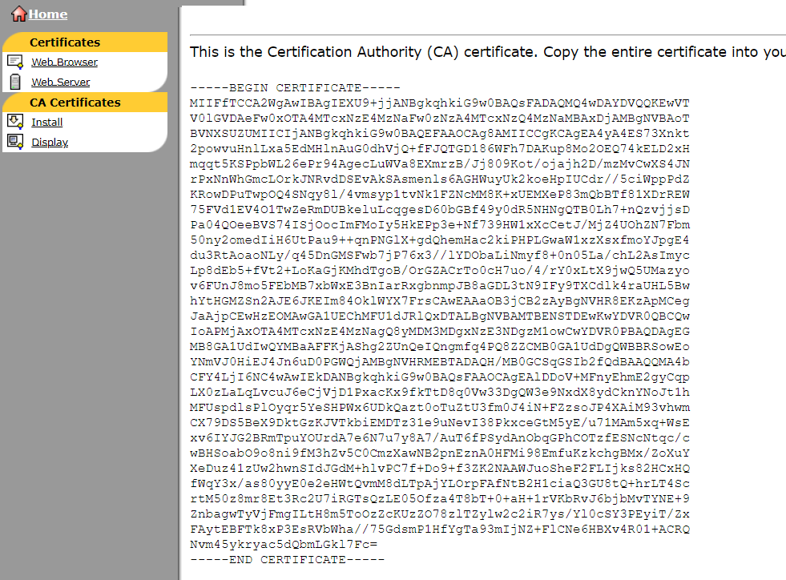

import Tabs from '@theme/Tabs';
import TabItem from '@theme/TabItem';

# Install Swift CA


## Download Swift CA certificate
Browse to Entrust Authority Enrollment Server for Web using one of the following URLs:

* https://wbcl01.swiftnet.sipn.swift.com:49171/cda-cgi/clientcgi?action=start
* https://wbcl02.swiftnet.sipn.swift.com:49171/cda-cgi/clientcgi?action=start


In the area `To retrieve CA certificates`, select the option `Display in PEM encoding` and
save the PEM encoded certificate in a text file with name `swiftca.pem`.



## Import Swift CA certificate

:::caution
This procedure might be different depending on the certificate tool you are using.
:::

Use keytool to create a keystore and import the Swift CA certificate:
<Tabs groupId="certificate-tool">
<TabItem value="keytool" label="Keytool">

```shell
keytool -import -trustcacerts -alias swiftca -file swiftca.pem -keystore keystore.jks
```

</TabItem>
<TabItem value="openssh" label="OpenSSH">

```shell
openssl x509 -in swiftca.pem -outform der -out swiftca.der
openssl pkcs12 -export -in swiftca.der -out keystore.p12 -nokeys
```

</TabItem>
</Tabs>
