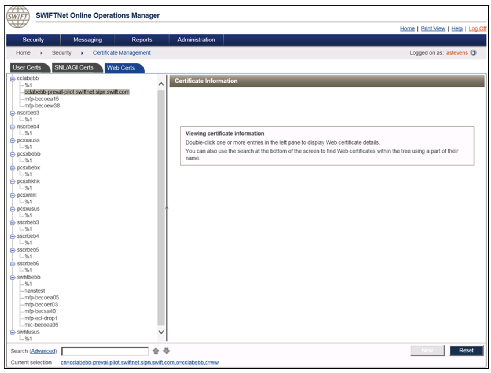

# Set up web server for certification

The certificate is used to secure the communication between the Swift API Gateway and the Bank’s API Gateway.

The first step is to create the certificate in the [Online Operations Management](https://www2.swift.com/go/book/book107594) (O2M) application.
Your SwiftNet security officer should set up the Distinguished Name (DN) assigned to your web server for certification.
Once the certificate is generated in the O2M portal, a key pair is generated and the certificate is signed by the SWIFTNet CA.

## Certificate creation in O2M

The following web server certificate DNs structure should be used:

:::info
The \<Service\> value depends on the API product. This value is provided by Swift.
:::

| Environments | Web server certificate DNs | Example |
| ---------------- | ------------------------------------------------------------------- | ------------------------------------------------------------------- |
| Live | cn= \<YourBank\>-\<Service\>.swiftnet.sipn.swift.com,o=\<YourBIC8\>,c=ww | cn=swhqbebb-preval.swiftnet.sipn.swift.com,o=swhqbebb,c=ww |
| Test and Training| cn= \<YourBank\>-\<Service\>-pilot.swiftnet.sipn.swift.com,o=\<YourBIC8\>,c=ww | cn=swhqbebb-preval-pilot.swiftnet.sipn.swift.com,o=swhqbebb,c=ww |

Below is a certification example, for the Payment Pre-validation Test and Training service, of a web server with DN: `cn=cclabebb-preval-pilot.swiftnet.sipn.swift.com,o=cclabebb,c=ww`.

For further use in next steps, please note down the **reference number** and **authorisation code**.

The key pair generation and the sign procedure is explained in the next section.