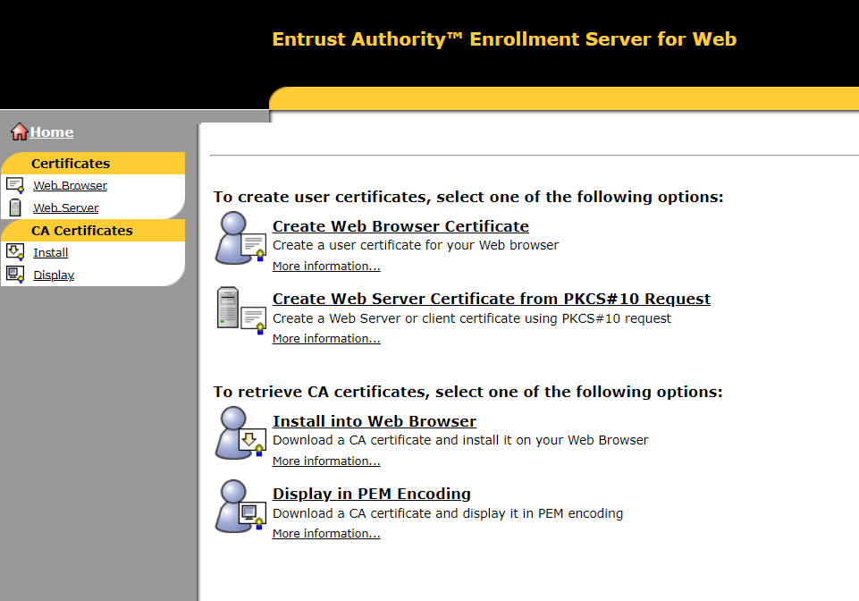
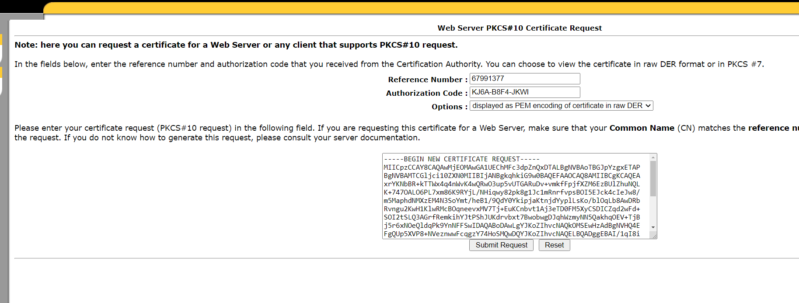

import Tabs from '@theme/Tabs';
import TabItem from '@theme/TabItem';


# Create and sign web server certificate

:::caution
This procedure might be different depending on the certificate tool you are using.
:::


### Create public/private key pair

Once we have the Swift CA certificate imported, we can create the key pair.

:::info
Below commands contains the following variables:
* The `REFERENCE NUMBER` value is the one provided by the O2M during the [set up web server for certification](./setup-web-server-certification) step.
* The `BIC8` value is the BIC 8 code of the institution.
* The `ALIAS_NAME` is just an identifier for the key and certificate. You can use any name you want.
:::

<Tabs groupId="certificate-tool">
<TabItem value="keytool" label="Keytool">

```shell
keytool -genkey -alias ALIAS_NAME -keyalg RSA -keysize 2048 -dname "cn=REFERENCE_NUMBER,o=BIC8,c=ww" -keystore keystore.jks
```

</TabItem>
<TabItem value="openssh" label="OpenSSH">

```shell
openssl genpkey -algorithm RSA -out private_key.pem -aes256
```

</TabItem>
</Tabs>

Either keytool or openssh can be used to generate the keystore. The following example uses keytool.

:::tip
Given the reference number `67231361` and certificate alias `gpi` the command should be:

```shell
keytool -genkey -alias gpi -keyalg RSA -keysize 2048 -dname "cn=67231361,o=swhqbebb,c=ww" -keystore keystore.jks
```
:::


### Generate CSR

The generated keypair in previous step is used to generate a certificate signing request (CSR).
The CSR is used to request a certificate from the Swift CA.

<Tabs groupId="certificate-tool">
<TabItem value="keytool" label="Keytool">

```shell
keytool -certreq -alias ALIAS_NAME -file csr.pem -keystore keystore.jks
```

</TabItem>
<TabItem value="openssh" label="OpenSSH">

```shell
openssl req -new -key private_key.pem -out csr.pem -subj "/C=ww/O=BIC8/CN=REFERENCE_NUMBER"
```

</TabItem>
</Tabs>

### Sign the certificate with the Swift CA

The CSR generated in the previous step is used to request a certificate from the Swift CA.

1. Browse to Entrust Authority Enrollment Server for Web using one of the following URLs:
    * https://wbcl01.swiftnet.sipn.swift.com:49171/cda-cgi/clientcgi?action=start
    * https://wbcl02.swiftnet.sipn.swift.com:49171/cda-cgi/clientcgi?action=start

2. Click `Create Web Server Certificate from PKCS#10 Request` in the area to create user certificates



3. Make sure that you enter the `REFERENCE NUMBER` and `AUTHORISATION CODE` that you received from the security officer.
Select `Displayed as PEM encoding of certificate in raw DER` from the drop-down list.
Paste the content of the certificate signing request from `csr.pem` file.



6. Click Submit Request

7. Save the PEM encoded certificate in a file with name `signed_cert.pem`.

### Import the certificate

Finally, the certificate signed by the Swift CA is imported into the keystore.

<Tabs groupId="certificate-tool">
<TabItem value="keytool" label="Keytool">

```shell
keytool -import -alias ALIAS_NAME -file signed_cert.pem -keystore keystore.jks
```

</TabItem>
<TabItem value="openssh" label="OpenSSH">

```shell
openssl pkcs12 -export -in signed_cert.pem -inkey private_key.pem -out keystore.p12
```

</TabItem>
</Tabs>

## Renew web server certificate

If your web server certificate has to be renewed after the web server has been certified, your SwiftNet security officer should set up the web server for recovery.

